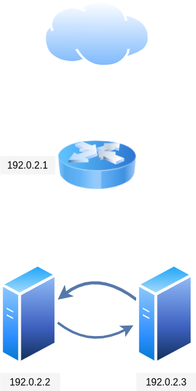

# Setup

Since ECMP is complicated to setup, for testing purposes, we will use another XDP application (**[`router`](../router/README.md)**) to to distribute packets in a round robin fashion.

The desired packet flow is for packets to come from external go through the router (Our custom eBPF application), then the router forwards the packets to one of the two servers with our main XDP application.

To achieve this, we will create three virtual machines with three different diract IPs (DIP), and add another virtual IP to each of these servers (VIP). For this to work, we will need resolve our ARP request to the router, the best way to ensure this is to turn on the router VM first and ping it, and only then open the two other VMs.

